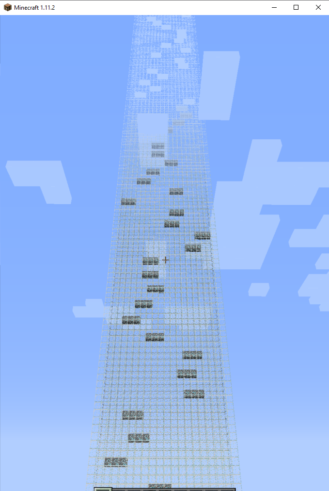

# Introduction 
In the modern world, people use autonomous robtos to do some work. Autonomous vacuum robots today commonly exists in many homes, it use sensors for obstacle dectection, new feature of cliff detection has been used as an additional sensing technology for safety. Under the development of technology, we believe that auto vacuum robots should have ability to detect cliff and down the stairs safely.Our project is a downhill survival game in the Minecraft, which asks the agent to go down the map as many levels as possible within limited steps. The agent is expected to have higher rewards for optimization (considered to be combination of less falling damages and less steps). The agent is a non-biology creatures but has courage to fall down from an 100-level building. No one can complete the task except a real man. 

# Steve
Steve was a robot vaccum in immaculate white before he fell down the stairs. 
Now, he's here. Steve is waiting in line to be questioned by the angels of Minecraft world. 
He was not the first robot who fell down from the stairs. Differently, Steve jumped from the stairs on purpose. In the past two years, he passed the way near the stairs for unlimited times but there was a voice told him "Get away from there, it's a "cliff"." Finally one day, curiosity triumphed over fear -- Steve didn't want to be blocked by the "cliff" and he wanted to be reborn. That's the reason for seeing him at the top of an 100-levels building. He vowed that he have to learn how to safely downstairs, in order to become a indefectible sweeping robot. 
No one has ever complete the tasks, but Steve thinks he can. Because he's a REALMAN.

# Source code: 
[GitHub Repo](https://github.com/JackZhaoYK/REALMAN)

# Reports:
- [Proposal](proposal.md)
- [Status](status.md)
- [Final](final.md)

# Members:
[Team Details](team.md)

# Group Meeting Time:
10:00 PM PST on Wednesdays and Sundays

